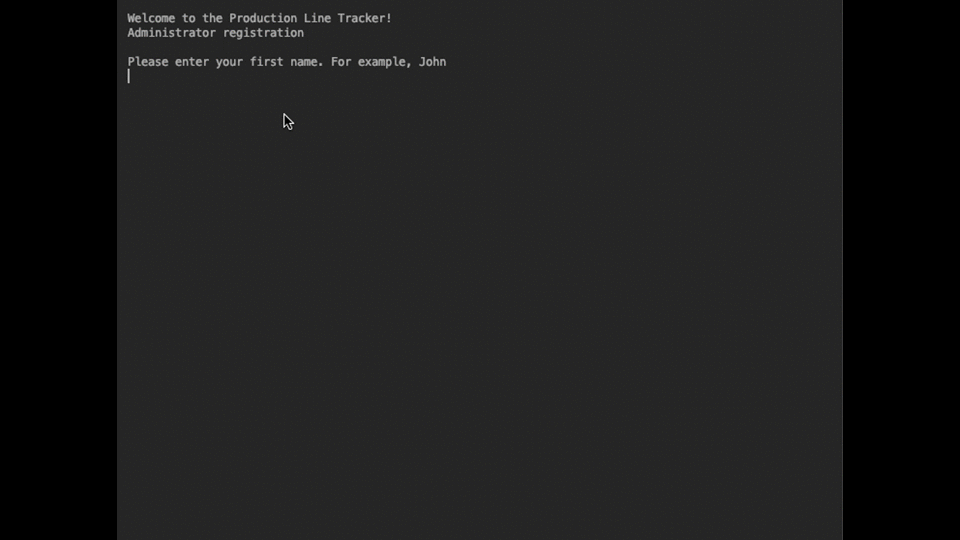
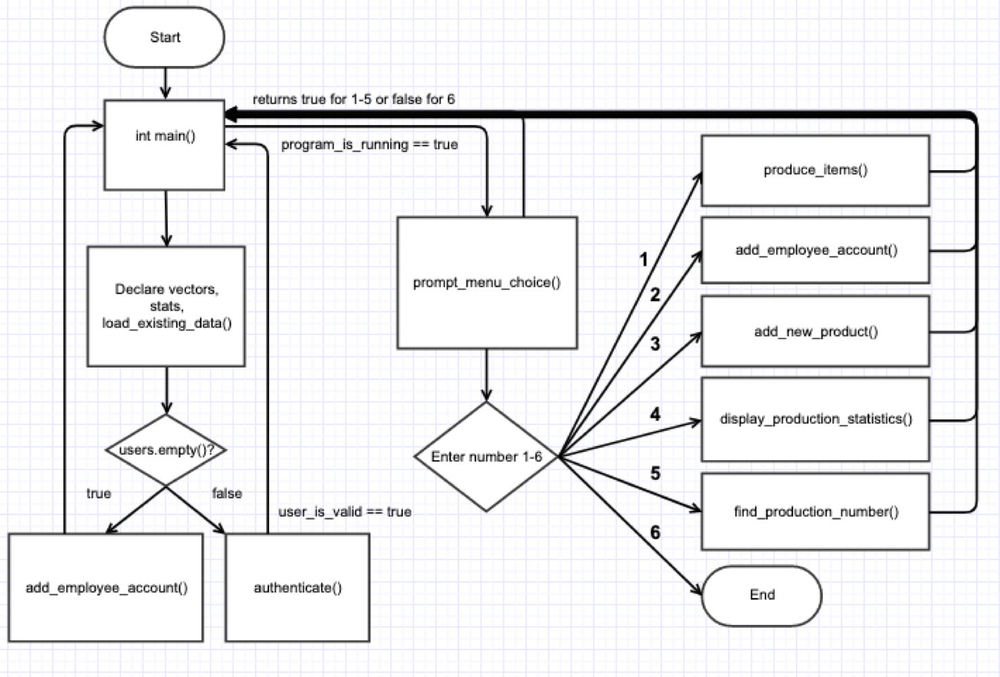

# FGCU COP2001 Procedural Project Summer A 2019

With this project we were tasked with creating a program to keep track 
of units produced on a production line. I made this program 
independently with about a year of experience programming and
contributing a minimum of 5 hours per week. This project was part of 
the COP2001 Programming Methodology curriculum at FGCU to teach us the 
challenge and benefits of procedural programming. 
 
## Demonstration
The first user enters credentials and is made an administrator. The
username is set by the first letter of the first name concatenated with
the last name in all lowercase. 

The production line tracker allows the user to add new products to the
product catalog, track production, register additional employees with 
a unique username and password, check production statistics, and to 
find the production number by entering a serial number.

## Documentation

Doxygen generated html:
[Link](https://nolzaj93.github.io/NolzProceduralProject/html/)

## Diagrams

## Getting Started
Set up your compiler and IDE, and to clone or download click the green
button at the top of 
[this](https://github.com/nolzaj93/NolzProceduralProject) 
page, then click Open in Desktop or download ZIP then extract.
An executable is coming soon.

## Built With
IDE - CLion 2019.1.3
This program was tested and debugged primarily on macOS.  
Compiler - GCC

## Contributing

I could use some input on how to securely store user data in a database.
Any improvements or suggestions are welcome.

## Author
- Austin Nolz

## License
MIT License

Copyright (c) 2019 Austin Nolz

Permission is hereby granted, free of charge, to any person obtaining a copy
of this software and associated documentation files (the "Software"), to deal
in the Software without restriction, including without limitation the rights
to use, copy, modify, merge, publish, distribute, sublicense, and/or sell
copies of the Software, and to permit persons to whom the Software is
furnished to do so, subject to the following conditions:

The above copyright notice and this permission notice shall be included in all
copies or substantial portions of the Software.

THE SOFTWARE IS PROVIDED "AS IS", WITHOUT WARRANTY OF ANY KIND, EXPRESS OR
IMPLIED, INCLUDING BUT NOT LIMITED TO THE WARRANTIES OF MERCHANTABILITY,
FITNESS FOR A PARTICULAR PURPOSE AND NONINFRINGEMENT. IN NO EVENT SHALL THE
AUTHORS OR COPYRIGHT HOLDERS BE LIABLE FOR ANY CLAIM, DAMAGES OR OTHER
LIABILITY, WHETHER IN AN ACTION OF CONTRACT, TORT OR OTHERWISE, ARISING FROM,
OUT OF OR IN CONNECTION WITH THE SOFTWARE OR THE USE OR OTHER DEALINGS IN THE
SOFTWARE.

## Acknowledgments
- Professor Scott Vanselow
- John from Cave of Programming/Udemy
- Olivier Gay and zedwood.com, sha256 hash function 
- [Link](http://www.zedwood.com/article/cpp-sha256-function) 

## History
The project started off structured with parallel vectors, and then was restructured to use vectors of user-defined data types called structs, which are like a class without methods.

## Key Programming Concepts Utilized
Abstraction, decomposition, procedural programming, functions, reference variables, salts, hash functions, primitive and abstract data types, vectors, structs, and input validation.

### Sprint 1 Backlog (SBL)

##### 1. Output a greeting and menu in main.
  
### Sprint 2 Backlog (SBL) - Conditions, Loops, Functions, Files intro. 

##### 1. Create a working menu
- The only menu options necessary for this sprint are Log Production and Exit.
- Only accept values that are listed in the menu.
- If the user selects a different value, they are asked to choose again.
- Menus is printed from a showMenu function that is called from main.
- Menu choices result in calls to functions.
- After output of menu choice, show menu again until user chooses to exit.
##### 2. Add functionality to log production for the products from the previous sprint.
- The user should be able to choose which of the products was produced.
- Able to enter how many of the products were produced.
- A record should be output that displays the production number, manufacturer, product name, item type and serial number. 
- ProductionNumber should be unique, sequential for all products, and automatically assigned.
- The SerialNumber should start with the first three letters of the Manufacturer, two letter itemType code, then five digits (leading 0s if necessary that are unique and sequential for the item type. The entire Serial Number should be automatically assigned.

### Sprint 3 - Arrays and Vectors, Searching and Sorting

##### 1. Store the product line in a collection (parallel vectors).
- Use code to populate some products.
- Allow the user to add products.
- All user to view the product line.
##### 2. When logging production, the user should be prompted to enter the product produced from the product line.
##### 3. Store the production log in a collection (parallel vectors). 
##### 4. Output the product line sorted by name.
##### 5. Given a Serial Number, output the Production Number 

### Sprint 4 - Pointers, Characters, Strings, Recursion

##### 1. Create an Employee account.
1. Allow user to input full name in format FirstName LastName.  
- Generate user id, which is their first initial and surname in all lowercase
- Optional: Don't allow duplicate user names.
2. Allow user to input a password.
- The password must contain at least one digit, at least one lowercase letter, and at least one uppercase letter. The password cannot contain a space or any other symbols. 
- Use a recursive function to encrypt the password. 
##### 2. Optional: Require users to log in. Track which employee recorded production.

### Sprint 5 - Data Structures, Structs, Files
##### 1. Store product line, production records, and production statistics in structs.
##### 3. Save the production log to a text file name ProductionLog.csv
##### 4. Save the user names and encrypted passwords to a text file name Users.txt
##### 5. Load data from the files into vectors of structs when the program starts.

### Sprint 6 - Quality Analysis

##### 1. Output production statistics such as total number of items produced and number of items of each type.
##### 2. Clear all warnings from Inspect Code.
##### 3. Format code using standard style guidelines.
##### 4. Enhance documentation:
- Javadoc style comments for Doxygen
- Comments in code
- README, create animated gif of program running
##### 5. Deployment